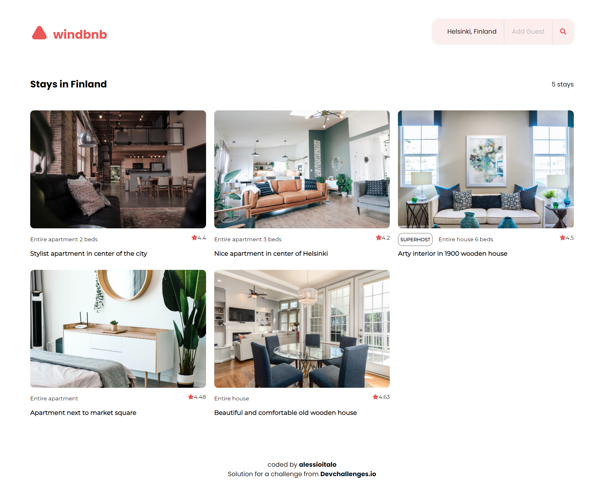

<h1 align="center">React WindBnb</h1>

<div align="center">
   Solution for a challenge from  <a href="http://devchallenges.io" target="_blank">Devchallenges.io</a>.
</div>


## Table of Contents

- [Overview](#overview)
- [Built With](#built-with)
- [Features](#features)
- [How to use](#how-to-use)
- [Contact](#contact)


## Overview



This was my first attempt to solving a challenge from devchallenges.io

The challenge itself was a lot of fun. I also practiced working with Figma designs.

### Built With

- [React](https://reactjs.org/)
- [StyledComponents](https://styled-components.com/)

## Features

The [challenge](https://devchallenges.io/challenges/3JFYedSOZqAxYuOCNmYD) was to build an application to complete the given user stories.

- User story: I can see a list of properties
- User story: I can see the property card with a name, rating, apartment type, and super host
- User story: I can open the filter drawer
- User story: I can filter properties by location and number of guests
- User story: I can see the number of filtered items
- User story: I can see pages following given designs

## How To Use

<!-- Example: -->

To clone and run this application, you'll need [Git](https://git-scm.com) and [Node.js](https://nodejs.org/en/download/) (which comes with [npm](http://npmjs.com)) installed on your computer. From your command line:

```bash
# Clone this repository
$ git clone https://github.com/alessioitalo/react-windbnb-challenge.git

# Install dependencies
$ npm install

# Run the app
$ npm start
```

## Contact

- Website [alessioitalo.uk](https://www.alessioitalo.uk)
- Twitter [@alessioitalo](https://twitter.com/alessioitalo)
